  

  

  
  
  

---

## About me

Systems Engineer focused on **software development, SQL, and automation scripting**. I build scripts, queries, and integrations that connect data with real operational use cases.

---

## What I build

- Python scripts for automation and test workflows (Selenium).
- SQL Server queries and stored procedures.
- API interaction scripts (Postman/Insomnia-based validation, requests-based scripting).
- Data processing and reconciliation scripts.

---

## Tools and technologies

<table align="center">
<tr>
<td valign="top" width="33%">

**Languages**
 

</td>
<td valign="top" width="33%">

**Databases**
 

</td>
<td valign="top" width="33%">

**Dev tools**
 

</td>
</tr>
</table>

---

## Currently learning

Playwright · CI/CD foundations · Git workflow structure · Docker basics · API automation architecture

---

## GitHub statistics

  

  

  

---

## GitHub trophies

  

---

## Connect with me

  

  

